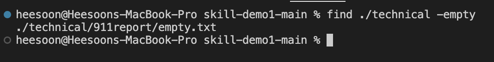
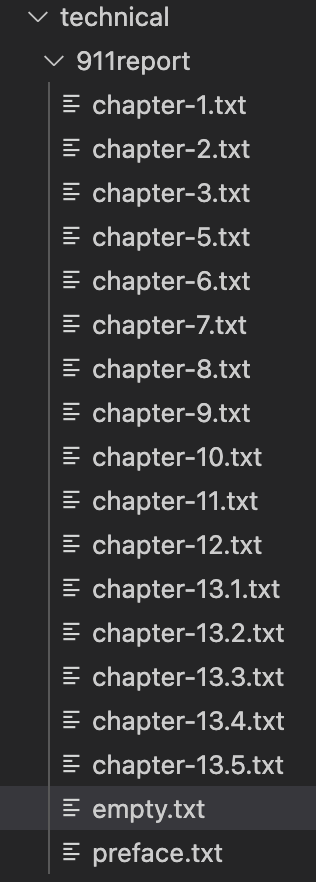
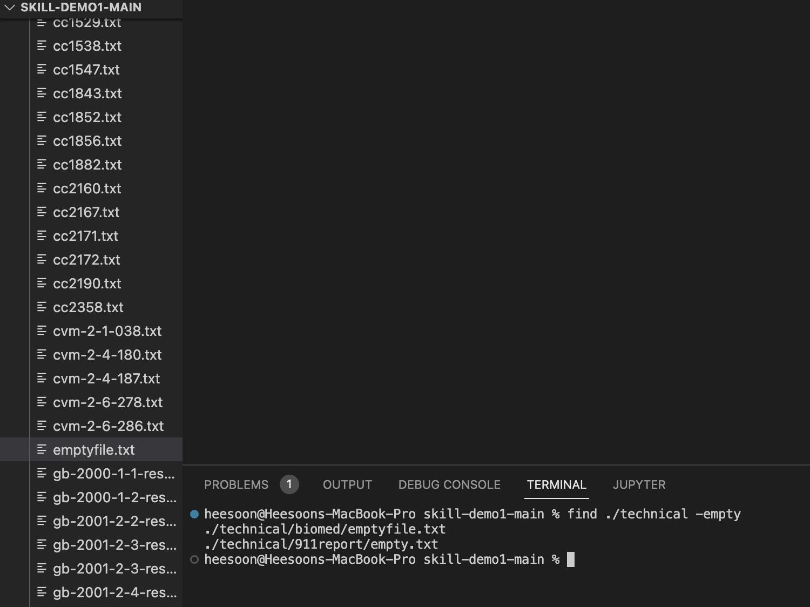
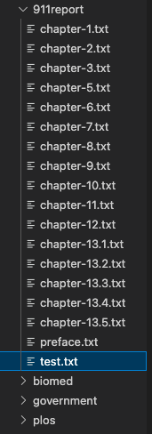
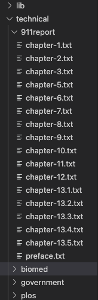
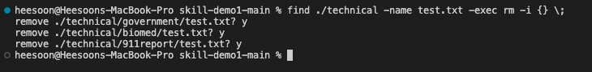
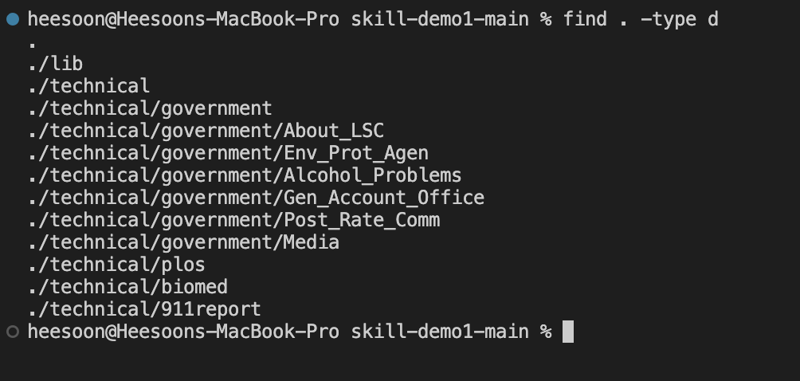
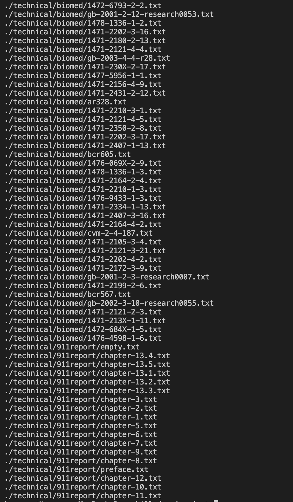
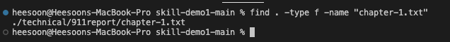

## **find command-line options** ##

## **1. -empty command** ##

<pre><code>  find ./technical -empty
</code></pre>

The command -empty searches for empty files and directories. This commands finds all empty folders and files in the entered directory or sub-directories. The above image is example of when trying -empty function in the technical directory where shows there is no empty file 

The above image is example of trying -empty when there exists a empty function. I have created one as a example: 

The above example is when there exits multiple empty files within the /technical. They were created in 911report and biomed files. This empty file would be helpful in real life because it's easy way to check if student "accidently" submitted empty file which can be happen when student forgets to save their code. 

## **2. -exec command** ##

<pre><code>  find ./technical -name filename.txt -exec rm -i {} \;
</code></pre> 

The command -exec rm -i {} \; prompts the user for a confirmation of if you want to delete inputted filename.txt or not. Y/y will result in deleting the file N/n will not delete the file. The above example is when there was empty.txt created, we found it's file then deleted it. EX: 

The above example is when there exists multiple same name files across the directory. The command will go through all same name files in the directory will prompt if the user will delete it or not.

The above example is when there exists no same name files that I want to delete then the command will be processed without any confirmation of user.

## **3. -type command** ##

<pre><code>  find . -type d
</code></pre> 

To find a file by its type, use the "-type" option with letters that are known as descriptors such as "f" for files, "d" for directories, and "I" for the symbolic link, and "s" for sockets. The above example is command for finding all directories of technical direstorty.

The above image is example of using type f command for technical directory which resulted in finding all the files in directory. This is useful to check if a directory contains all the necessary files.

The above command is doing using type and name command to search to see file we are looking to see if it exits in the current directory.

