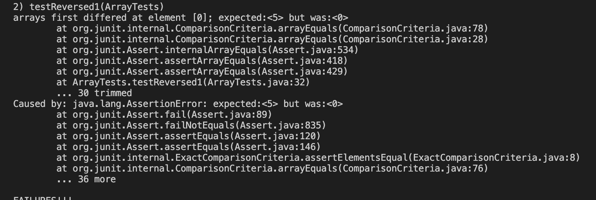

## **Part 1 Simplest Search Engine from week 2** ##

**SearchEngine.java**
<pre><code> 
import java.io.IOException;
import java.net.URI;
import java.util.ArrayList;

class Handler implements URLHandler {
    // The one bit of state on the server: a number that will be manipulated by
    // various requests.
    //create a list and add them 
    int num = 0;

    ArrayList<String> save = new ArrayList<>();
    ArrayList<String> search = new ArrayList<>();

    public String handleRequest(URI url) {

        if(url.getPath().contains("/add")) {
            String[] parameters = url.getQuery().split("=");
            if(parameters[0].equals("s")) {
                if(!save.contains(parameters[1])) {
                    save.add(parameters[1]);
                }
                return String.format(parameters[1] + " was searched");
            }
        } else if(url.getPath().contains("/search")) {
            String[] parameters = url.getQuery().split("=");
            for(String searched: save) {
                if(save.contains(parameters[1])) {
                   search.add(searched);
                }
            }
            return search.toString();
        } else {
            return "Welcome to Search test!";
        }

        return "404 Not Found";
       
    }
}

class SearchEngine {
    public static void main(String[] args) throws IOException {
        if(args.length == 0){
            System.out.println("Missing port number! Try any number between 1024 to 49151");
            return;
        }

        int port = Integer.parseInt(args[0]);

        Server.start(port, new Handler());
    }
}
</code></pre>

## **Screenshot of using SearchEngine.java** ##

- 1. **Defualt page**

The following output is coming from method handleRequest where it's a default value has been returned if theres no instruction of "add?s=". The method handleRequest has four different arguments where it checks if whether url path contains "/add", "/search", or other different inputs. If the input of url changes, then the output of the website would have been different

- 2. **Adding / Searching an element**

The following outputs are also coming from handleRequest method where it checks if url contains "/add", "s" and "=". If so, we would save the string value and save it to the arraylist called save. Once the string has been added to the save arraylist, then it prints out by toString method to output "User's search element" + "save". 

- 3. **Query ( Outputs elements that I searched)**

The following outputs are from handleRequest method where this time, it checks if url contains "/search" and "=" in the URL. One if statement that checks if URL contains "/search" and "=" then it iterates through for loop to add all the saved items to Arraylist called searched. Then it once again uses toString method from arraylist to print out above output.
- 4. **Wrong input**

The above output is just example of inputting strings that were not covered by the if statements in the handleRequest. If does not reconizes the following URL then it print default outputs "404 Not Found". 

## **Part 2 Two Bugs from Different Files** ##

Choose two of the bugs from different files above. For each, show:

The failure-inducing input (the code of the test)
The symptom (the failing test output)
The bug (the code fix needed)
Then, explain the connection between the symptom and the bug. Why does the bug cause that particular symptom for that particular input?

## Bug #1 Array Examples
## **Test**

## **Symtoms**

## **Bug**

The bug in this example was that there was that the coder initialized a new array to save in reversed values from orignial array and return new array. However, the person switched places of two arrays where new array which is empty,as one that gives elements to the existing array. Then the code assigns values from the empty array to array that we need to reverse. This bug causes the following symtoms that was outputted above. So with previous code, with any type of testing inputs, it would not return correct values since they are return original array other then new array.

## **Fixed**

To fix this bug, swap the array where newArray at array's length - i - 1 is saving values of array at i. Then return new array

## Bug #2 List Example
## **Test**

## **Symtoms**

## **Bug**

The bug in this example was that the code had existing infinite loop when the code was running which lead to the followig symtoms. The infinite loop lead the test to fail and returns list of infinite addition of index2 but also the index at which elements were placed are wrong. 

## **Fixed**

To fix this bug I just fixed the increment value at third while loop then changed the index1 += 1 to index2 += 1.

    

