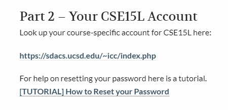

# Lab Report 1

**How to log into a course-specific on ieng6**

## **Step 1. Find Your Account!**

- The absolute first step to logging in is to know what is your CSE15L account which can be found from following [Link](https://sdacs.ucsd.edu/~icc/index.php).
- Find out your ID by your PID and username or lastname.

## **Step 2. Installing Visual Studio Code**

- The second step is to download [Visual Studio](https://visualstudio.microsoft.com/downloads/).
- Visual studio allows you to use their terminal to access ieng6 but local terminal from your pc will still work. 

## **Step 3. Accessing Remote Server**

- The following picture is what your output should look like after you have sucessfully logged into the server.
- When you terminal is open from visual studio, you will first need to log into the ieng6 server. To do so, you will need type your username you got from **step 1** and password (which you resetted from the start) or currently your triton link password. 
<<<<<<< HEAD

=======

>>>>>>> 60cdec6f083fdfbc8ba13c3f73de8bf2caae1790
- However, there is chance that you will need to use your ucsd email 
(ex: ******@ieng6.ucsd.edu) to log into the server if your new password has not been updated in next 20 mins.

## **Step 4. Using Commands**

- Now that you have successfully logged into the ieng6 server, let's try out from functions. 
- The following screenshot is what it looks like when you have succefully called ls -lat functions. But you should try various functions (ex: cd ~, cd, ls <directory>...)
<<<<<<< HEAD

=======
>>>>>>> 60cdec6f083fdfbc8ba13c3f73de8bf2caae1790
- 1. **cd** - change directory
- 2. **ls** - listing files from current directory
- 3. **pwd** - print working directory
- 4. **cat** - prints all files within curent directory
- Note: Some of the functions will not have any output

## **Step 5. Copy files using SCP **

<<<<<<< HEAD

=======

>>>>>>> 60cdec6f083fdfbc8ba13c3f73de8bf2caae1790
- Now that you tried some functions, lets move files over SSH with scp. This is another way of copying file from local computer to remote computer. 
- The above screenshot is just an example of accessing file from the terminal. 

## **Step 6. Setting up SSH key**

=======

>>>>>>> 60cdec6f083fdfbc8ba13c3f73de8bf2caae1790
- The following screenshot is output after you have operated SSH key by calling ssh-keygen function. The function of this operation is to create both public and priate key.

- After following step, you will need to give defualt path to your id_rsa file. Then store them into the .ssh file which will allow the user to log back into the ieng6 server without actually entering password.

## **Finally Step 7, last thing to know for convenience**

- The following screenshot is an output after quoting "ls" in the end of ssh command. 
- The purpose of this function is to directly run the file on the remote server without having actaully copying file from local to remote. 
  
 ## **Conclusion**
 Once you have completed through all the steps, your know should be able to log in and out and perhaps more in the ieng6 server. 
