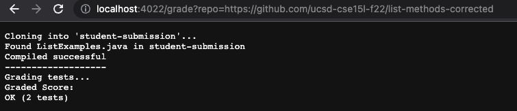
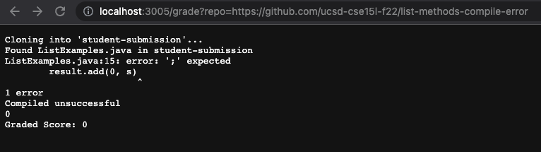
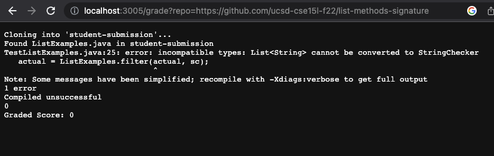

# Lab Report Week 8

```
rm -rf student-submission

git clone $1 student-submission

if [ -f ./student-submission/ListExamples.java ]
then
    echo "Found ListExamples.java in student-submission"
else
    echo "Not found ListExamples.java in student-submission"
    echo "Graded Score: 0"
    exit 1
fi

cp ./TestListExamples.java ./student-submission
cp -r ./lib ./student-submission

cd ./student-submission

javac -cp .:lib/hamcrest-core-1.3.jar:lib/junit-4.13.2.jar *.java

if [ $? -eq 0 ]
then
    echo "Compiled successful"
else
    echo "Compiled unsuccessful"
    echo $?
    echo "Graded Score: 0"
    exit 1
fi
echo "-------------------"
echo "Grading tests..."

java -cp .:lib/hamcrest-core-1.3.jar:lib/junit-4.13.2.jar org.junit.runner.JUnitCore TestListExamples > grade.txt

echo "Graded Score:"
grep -i "test" grade.txt

```
# Screenshots of three different student submissions

**1**




**2**





**3**



# describe a trace of what your grade.sh does on that example.

<pre><code>rm -rf student-submission
git clone $1 student-submission
</code></pre> 

The first line of the code will delete previous student-submission file if there is any and clone the next student-submission that will be checked. The standard exit code would be 0 because the student-submission directory already exists in the current directory which will make the code run without error and also the github repository existes so it will clone wihtout an error.


<pre><code>if [ -f ./student-submission/ListExamples.java ]
then
    echo "Found student java file..."
else
    echo "No student java file..."
    echo "Graded Score: 0"
    exit 1
fi
</code></pre> 

This codes of if statements will check if the file called ListExamples.java exits in the file of student-submission and if it founds the file then it prints "found student java file" while if it is not true then return No student java file and exit with code 1. However in the case of testing assuming all files exists, the standard error code will be 0 assuming that all files are already existing in the student submission.


<pre><code>cp ./TestListExamples.java ./student-submission
cp -r ./lib ./student-submission
cd ./student-submission
</code></pre> 

This part of code will copy and paste TestListExamples.java and the livraries in the lib directory into student submission then access student submission directory. In the case of testing, these codes will exit with 0 assumming there are all done successfully. 


<pre><code>javac -cp .:lib/hamcrest-core-1.3.jar:lib/junit-4.13.2.jar *.java

if [ $? -eq 0 ]
then
    echo "Compiled..."
else
    echo "Did not compile..."
    echo $?
    echo "Graded Score: 0"
    exit 1
fi

echo "------------------------------"
echo "Grading tests..."
</code></pre> 

We are calling a Junit test in the first line then set of codes of if statement is checking if the files compiled successfully in the directory. However, if it does not compile then it will exit with code 1 printing "did not compiled: as well as $?. In the case of testing corrected link, we can asssume that the code will exit with code 0 because all the files will be compiled correctly. Also it will output the sign compiled before exiting with code. After the if statement has compiled, I am printing for format wise.


<pre><code>java -cp .:lib/hamcrest-core-1.3.jar:lib/junit-4.13.2.jar org.junit.runner.JUnitCore TestListExamples > grade.txt

echo "Graded Score:"
grep -i "test" grade.txt
</code></pre> 

In this code, we are running TestListExamples in the Junit test and outputing the results to the txt file. The exit code will be 0 assuming that we are running a corrected student submission file.
